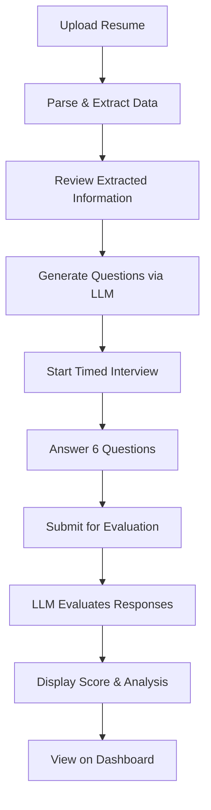

# Interview AI - Automated Technical Interview Platform

An intelligent, AI-powered interview platform that conducts automated technical assessments using LLM technology. Built with React, TypeScript, and Redux Toolkit, this application streamlines the technical interview process with dynamic question generation and automated evaluation.

## 🎯 Overview

Interview AI is a modern web application that enables candidates to complete time-bound technical interviews while providing interviewers with comprehensive performance analytics. The platform leverages OpenAI's API to generate contextually relevant questions and evaluate candidate responses objectively.

## ✨ Key Features

### For Candidates
- **Smart Resume Processing**: Upload resumes in PDF, DOCX, or TXT format with automatic data extraction
- **AI-Generated Questions**: 6 dynamically generated technical questions tailored to Node.js/React
- **Timed Assessment**: Difficulty-based time allocation
  - 2 Easy questions (20 seconds each)
  - 2 Medium questions (60 seconds each)
  - 2 Hard questions (120 seconds each)
- **Auto-Save & Recovery**: Seamless state recovery if the browser is accidentally closed
- **Instant Feedback**: Receive detailed performance analysis immediately after completion

### For Interviewers
- **Comprehensive Dashboard**: Track and analyze candidate performance
- **Objective Scoring**: AI-powered evaluation with scores out of 100
- **Detailed Analytics**: Access performance summaries, rankings, and candidate details
- **Candidate Management**: Review multiple interview results in one place

## 🛠️ Technology Stack

| Category | Technologies |
|----------|-------------|
| **Frontend** | React 18, TypeScript |
| **State Management** | Redux Toolkit |
| **AI/LLM** | OpenAI API |
| **Styling** | CSS3 |
| **File Parsing** | Custom utilities for PDF, DOCX, TXT |

## 📁 Project Structure

```plaintext
interviewAi/
├── src/
│   ├── assets/                    # Static files (images, logos)
│   ├── components/
│   │   ├── ui/                    # Reusable UI components (Button, Input)
│   │   ├── CandidateSucess.tsx    # Post-interview success screen
│   │   ├── ExtractedDataReview.tsx # Resume data review component
│   │   ├── GeneratingQuestions.tsx # Question generation loading screen
│   │   ├── InterviewComplete.tsx   # Final results display
│   │   ├── QuestionDisplay.tsx     # Question and timer display
│   │   ├── ResumeProcessor.tsx     # Resume parsing container
│   │   ├── ResumeUpload.tsx        # File upload interface
│   │   ├── Timer.tsx               # Countdown timer component
│   │   └── WelcomeBack.tsx         # Session recovery component
│   ├── redux/
│   │   ├── slices/
│   │   │   └── interviewSlice.ts   # Interview state management
│   │   └── store.ts                # Redux store configuration
│   ├── utils/
│   │   ├── questionGenerator.ts    # LLM API integration
│   │   ├── resumeParser.ts         # Resume parsing logic
│   │   └── storage.ts              # Browser storage utilities
│   ├── App.tsx                     # Main application component
│   ├── App.css                     # Global styles
│   ├── index.css                   # Root styles
│   └── main.tsx                    # Application entry point
├── .env.local                      # Environment variables (not tracked)
├── package.json
└── README.md
```

## 🚀 Getting Started

### Prerequisites

- Node.js (v16 or higher)
- npm or yarn
- OpenAI API key

### Installation

1. **Clone the repository**
   ```bash
   git clone https://github.com/Dakshjain1604/interviewAi.git
   cd interviewAi
   ```

2. **Install dependencies**
   ```bash
   npm install
   # or
   yarn install
   ```

3. **Configure environment variables**
   
   Create a `.env.local` file in the root directory:
   ```env
   VITE_OPENAI_API_KEY=your_openai_api_key_here
   ```

4. **Start the development server**
   ```bash
   npm run dev
   # or
   yarn dev
   ```

5. **Open your browser**
   
   Navigate to `http://localhost:5173` (or the port shown in your terminal)

## 📋 Application Flow



### Detailed Steps

1. **Resume Upload**: Candidate uploads their resume in supported format
2. **Data Extraction**: System parses and extracts name, email, and phone number
3. **Data Review**: Candidate confirms or edits extracted information
4. **Question Generation**: AI generates 6 technical questions based on difficulty levels
5. **Interview Session**: Candidate answers questions within allocated time limits
6. **Auto-Submission**: Answers automatically submit when timer expires
7. **Evaluation**: AI evaluates responses and generates comprehensive feedback
8. **Results**: Candidate receives score (0-100) and detailed performance analysis
9. **Dashboard**: Results are accessible to interviewers for review

## 🎨 Features in Detail

### Resume Processing
- Supports multiple file formats (PDF, DOCX, TXT)
- Intelligent data extraction using custom parsing utilities
- Manual review and correction capability
- Validation before interview starts

### Dynamic Question Generation
- Tailored questions based on Node.js and React technologies
- Balanced difficulty distribution
- Context-aware question selection
- Real-time generation using OpenAI API

### Smart Timer System
- Difficulty-based time allocation
- Visual countdown display
- Auto-submission on timeout
- Warning indicators for time running out

### State Recovery
- Automatic progress saving
- Session recovery on page reload
- No data loss on accidental closure
- Seamless resume of interrupted sessions

## 🔒 Environment Variables

| Variable | Description | Required |
|----------|-------------|----------|
| `VITE_OPENAI_API_KEY` | Your OpenAI API key | Yes |


**Built with ❤️ using React, TypeScript, and AI**